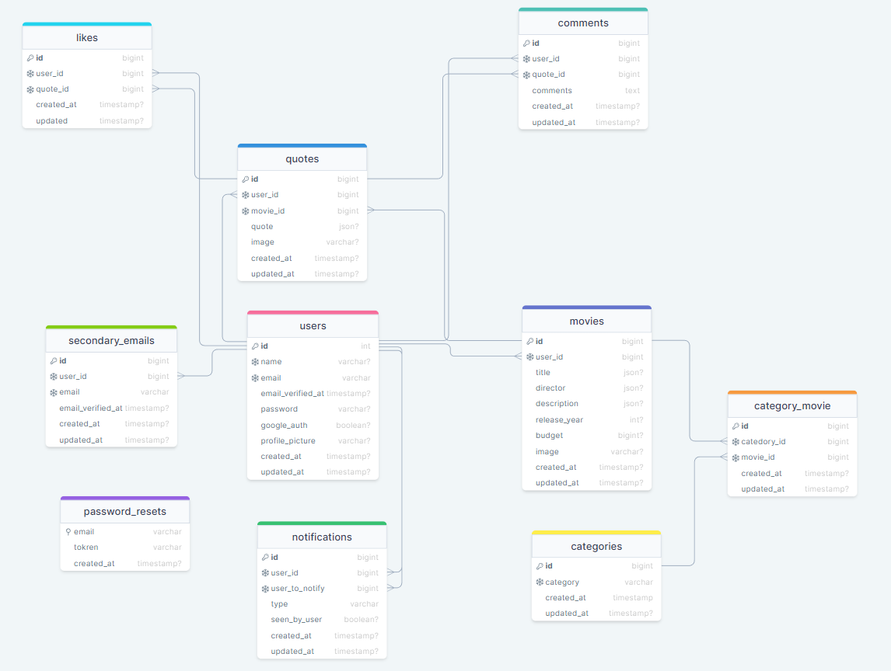

<div style="display:flex; align-items: center">
  <h1 style="position:relative; top: -6px" >Movie Quotes Upgraded</h1>
</div>

---
Movie Quotes is an App where you are able to register and see, add, share, comment and like hundreds of movie quotes.

#
### Table of Contents
* [Prerequisites](#prerequisites)
* [Tech Stack](#tech-stack)
* [Getting Started](#getting-started)
* [Migrations](#migration)
* [Development](#development)
* [Resources](#resources)

#
### Prerequisites

*  *PHP@8.1 and up*
*  *MYSQL@8 and up*
*  *npm@7 and up*
*  *composer@2.4 and up*


#
### Tech Stack

*  [Laravel@9.x](https://laravel.com/docs/9.x) - back-end framework
*  [Spatie Translatable](https://github.com/spatie/laravel-translatable) - package for translation
*  [Tailwind CSS](https://tailwindcss.com) - CSS library
* [JWT Aath](https://laravel-jwt-auth.readthedocs.io/en/latest/) - JWT authentification package
* [Pusher](https://pusher.com) - Real time notification package


#
### Getting Started
1\. First of all you need to clone >Movie Quotes Upgraded repository from github:
```sh
git clone https://github.com/RedberryInternship/guram-tsagareishvili-epic-movie-quotes-back
```

2\. Next step requires you to run *composer install* in order to install all the dependencies.
```sh
composer install
```

3\. after you have installed all the PHP dependencies, it's time to install all the JS dependencies:
```sh
npm install
```

4\. We need to link our storage folder to public folder:
```sh
php artisan storage:link
```

5\. Now we need to set our env file. 
```sh
cp .env.example .env
```
6\. Next we need to generate Laravel key:
```sh
php artisan key:generate
```
7\. After that we must configur JWT authentification:

7.1 We need need to publish jwt config:
```sh
php artisan vendor:publish --provider="PHPOpenSourceSaver\JWTAuth\Providers\LaravelServiceProvider"
```

7.2 Generate jwt secret:
```sh
php artisan jwt:secret
```

7.2 Generate certificate:
```sh
php artisan jwt:generate-certs
```

And now you should provide **.env** file all the necessary environment variables:

#
**MYSQL:**
>DB_CONNECTION=mysql

>DB_HOST=127.0.0.1

>DB_PORT=3306

>DB_DATABASE=*****

>DB_USERNAME=*****

>DB_PASSWORD=*****

#
**Pusher:**
>ROADCAST_DRIVER=pusher

>CACHE_DRIVER=file

>FILESYSTEM_DISK=public

>QUEUE_CONNECTION=sync

>SESSION_DRIVER=file

>SESSION_LIFETIME=120

>PUSHER_APP_ID=*****

>PUSHER_APP_KEY=*****

>PUSHER_APP_SECRET=*****

>PUSHER_PORT=443

>PUSHER_SCHEME=https

>PUSHER_APP_CLUSTER=*****

#
**App urls:**
>VITE_API_BASE_URL=*****

>BASE_URL=*****

#
**Email:**
>MAIL_MAILER=*****

>MAIL_HOST=*****

>MAIL_PORT=2525

>MAIL_USERNAME=*****

>MAIL_PASSWORD=*****

>MAIL_ENCRYPTION=*****

>MAIL_FROM_ADDRESS=*****

>MAIL_FROM_NAME="${APP_NAME}"

##### Now, you should be good to go!

#
### Migration
if you've completed getting started section, then migrating database if fairly simple process, just execute:
```sh
php artisan migrate
```

Once migration is complete we should seed database with our categories:
```sh
php artisan db:seed --class=CategorySeeder
```

#
### Development

You can run Laravel's built-in development server by executing:

```sh
  php artisan serve
```

For Tailiwind CSS to work you must also run:

```sh
  npm run dev
```

#
### Resources

1\. Database structure in DrawSQL:
```sh
https://drawsql.app/teams/skeleton-team/diagrams/movie-quotes-upgraded
```


2\. Swagger documentation:
```sh
/swagger
```